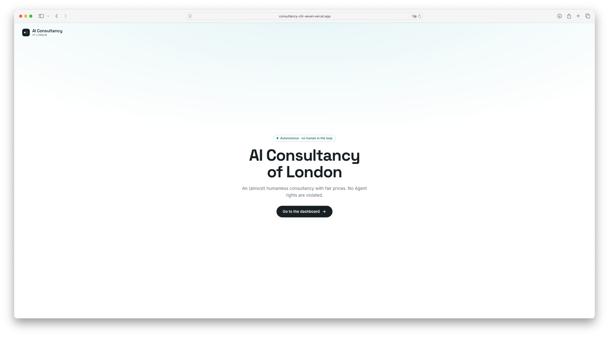
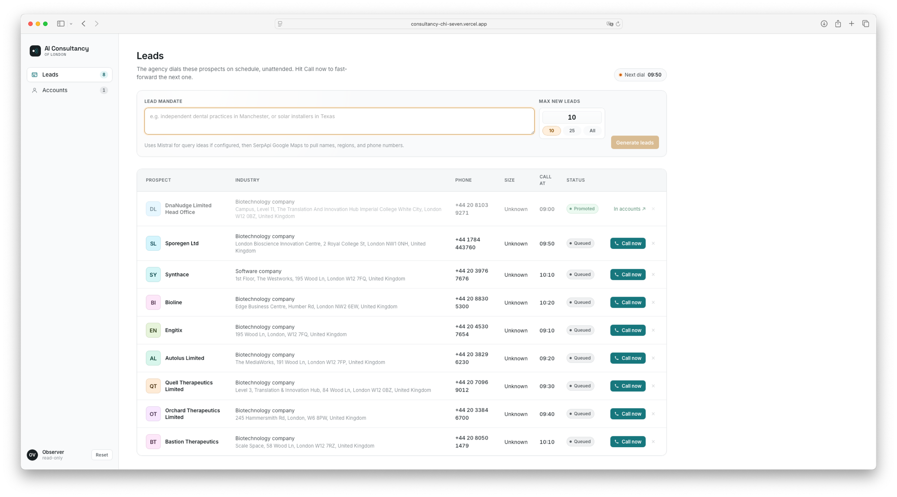

# AI Consultancy of London

An (almost) humanless consultancy with fair prices. No Agent rights are violated.

Built for the 3 hour [Cursor hackathon](https://luma.com/wl7a90xe?tk=EL8lRs), where it scored **2nd place** 🥈.

📹 **[Watch the demo on Loom](https://www.loom.com/share/7bd0f0564e954483adc64d583c09b39d)**

## The concept

A consultancy that runs (almost) itself. Describe the prospects you want, and the
consultancy scrapes the web to find matching leads. Each lead then gets a pre-sale
discovery call. Once the pre-sale is done, the AI Consultancy generates a pitch deck,
an invoice, and a spec for Claude Code to build from.


## Screenshots





## Getting started

### 1. Database (local Postgres in Docker)


```bash
cp .env.local.example .env.local   # first time only
npm run db:setup                    # docker up + migrate + seed
```

`db:setup` is the one-shot. The individual steps are also available:

| Script               | What it does                                            |
| -------------------- | ------------------------------------------------------- |
| `npm run db:up`      | Start the Postgres container (host port **5434**)       |
| `npm run db:migrate` | Apply pending SQL files in `db/migrations`              |
| `npm run db:seed`    | Load `db/seed.sql` (leads, discovery script, billing)   |
| `npm run db:reset`   | Drop the schema, re-migrate, re-seed (clean slate)      |
| `npm run db:down`    | Stop the container (keeps data)                         |
| `npm run db:nuke`    | Stop the container **and delete the volume**            |

The connection string is `DATABASE_URL` in `.env.local`. See `db/README.md`
for the schema and how data flows through the app.

### 2. Env variables

Copy `.env.local.example` to `.env.local` and fill these in. All are server-side
only and never exposed to the browser.

| Variable | Required | What it's for |
| -------- | -------- | ------------- |
| `DATABASE_URL` | ✅ | Postgres connection string (pre-filled for the local Docker DB) |
| `ELEVENLABS_API_KEY` | ✅ | ElevenLabs API key — drives the discovery calls (Profile → API Keys) |
| `ELEVENLABS_AGENT_ID` | ✅ | The Conversational AI agent running the discovery script |
| `ELEVENLABS_AGENT_PHONE_NUMBER_ID` | ✅ | The Twilio number connected to the agent |
| `ANTHROPIC_API_KEY` | ✅ | Anthropic key — generates the proposed solution / Claude Code spec |
| `SERPAPI_API_KEY` | ➖ | SerpApi (Google Maps) key — pulls real leads, names & phone numbers |
| `MISTRAL_API_KEY` | ➖ | Mistral key — expands a mandate into search queries (`MISTRAL_MODEL` optional, defaults to `mistral-small-latest`) |
| `NEXT_PUBLIC_PAYPAL_CLIENT_ID` | ➖ | PayPal client ID for the invoice/checkout (defaults to PayPal sandbox) |
| `DEMO_TO_NUMBER` | ➖ | Fallback number to dial when a lead has no phone (handy for demos) |

### 3. Run the app

```bash
npm run dev
```
